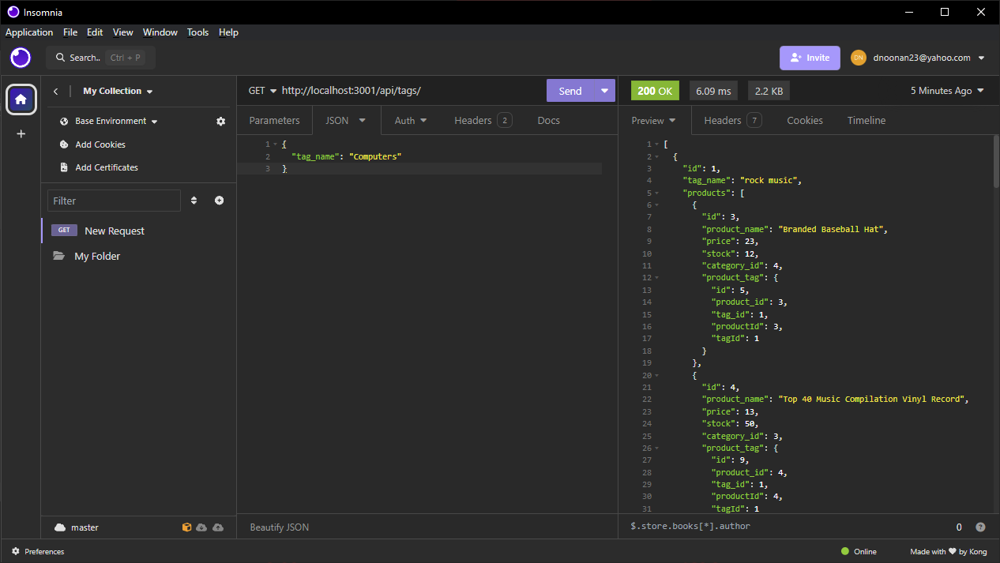

# ORM E-Commerce Back-End

## Description

This project was to create a node application that could find, add, alter, and delete items from a database.  The most difficult part was getting the database to populate correctly as every time I would start the server the seeds would be deleted. 

## Installation

To run the program you first need node installed and mysql.  Then open the folder in a terminal and type 'npm install' to get the necesary files.  You will also need a program such as insomnia or postman to run the routes.

## Usage

After all the proper files are installed on your computer, open the folder in a terminal.  Then type `mysql -u root -p` and type in your password to start mysql.  Once in mysql type `SOURCE ./db/schema.sql` to start running the database, then you can quit out.  while still in the terminal type `npm run seed` to seed the database.  Then finally type `node server.js` to launch the application.  It will be running on `http://localhost:3001/`.  From there use your chosen program to run GET, POST, PUT, and DELETE methods by going to `http://localhost:3001/api/products`, `http://localhost:3001/api/categories`, or `http://localhost:3001/api/tags`.

Video demonstration: https://youtu.be/ebf40BfS03I

## Credits

Some code modified from code taken from: 
https://git.bootcampcontent.com/

## Features

This program features routing for GET, POST, PUT, and DELETE methods